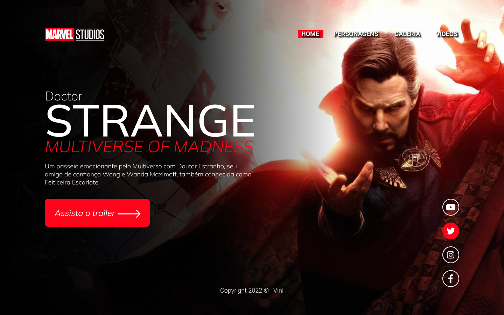
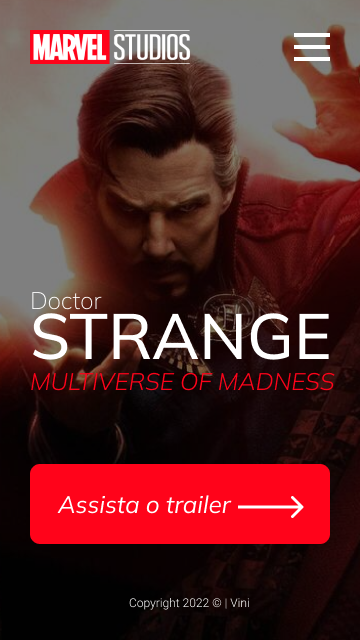
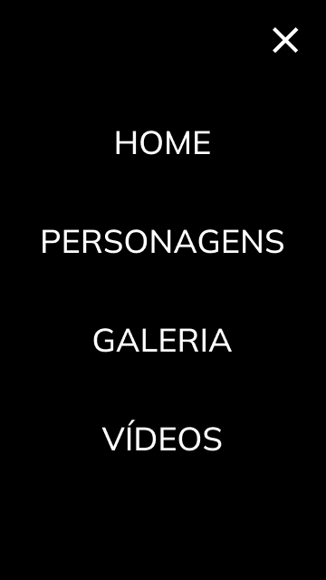

# Strange 2022
Projeto construído durante as aulas de LIMA, no curso de Desenvolvimento de Sistemas do [SENAI Jandira](https://jandira.sp.senai.br/), com orientação do Prof. [Fernando Leonid](https://github.com/fernandoleonid)

    
    

---

## Qual o objetivo do projeto?
O objetivo era criar uma landing page com base no design feito no Figma, aprendendo a estrutura do HTML, CSS, JavaScript e conceitos de responsividade.

---

## O que é uma Landing Page?
Uma Landing Page é uma página com foco principal na conversão de visitantes, assim, essas páginas possuem uma estética mais minimalista comparada com os sites tradicionais.

---

## Tecnologias usadas
- HTML 5
- CSS 3
- JavaScript
- Figma

---

## Links
- [Resultado Final](https://vini00784.github.io/Doctor-Strange-2022/)
- [Design realizado no Figma](https://www.figma.com/file/WLuo0ju2cOq1DwCk9UmgaP/Lima---Strange?node-id=11%3A75)
- [Repositório do GitHub](https://github.com/vini00784/Doctor-Strange-2022)

---

## Autor
- [Vinícius Santos Oliveira](https://github.com/vini00784)